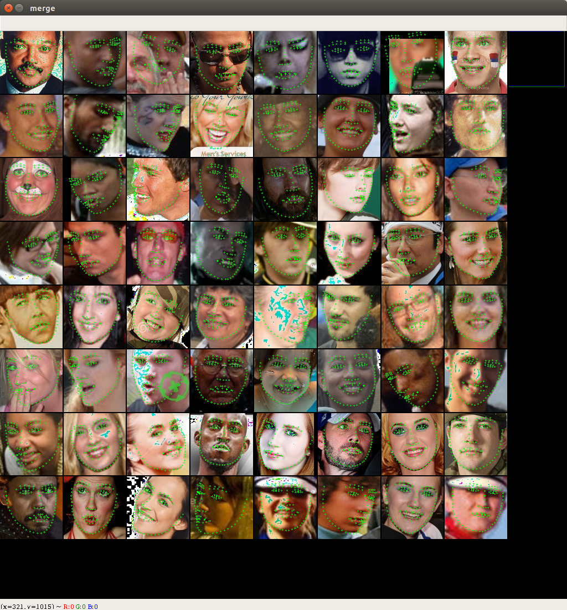
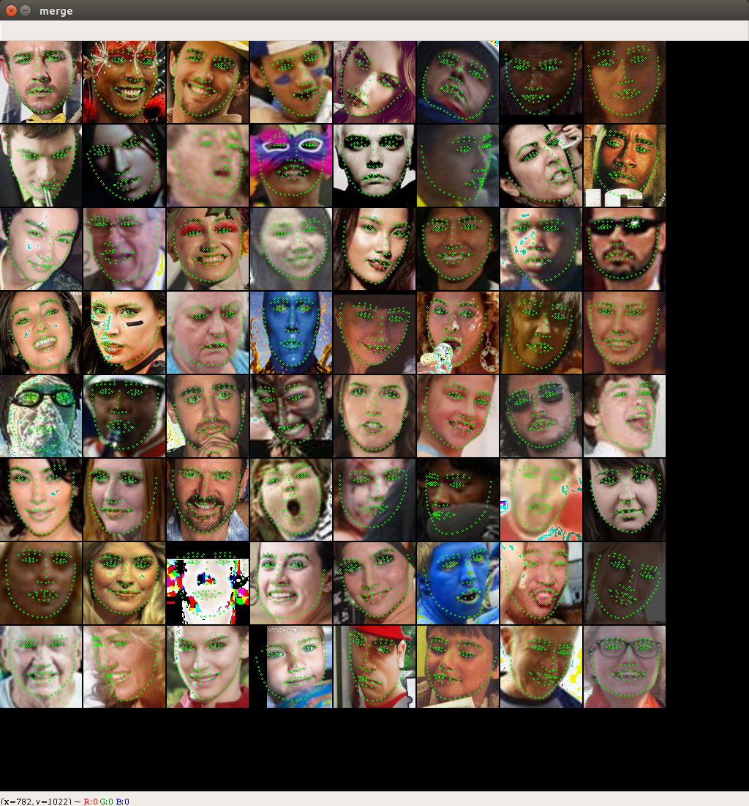

## A Practical Facial Landmark Detector

### Introduction

Implementation of PFLD A Practical Facial Landmark Detector by pytorch.

#### 1. Data preparation:
- WFLW Dataset Download：
  - WFLW Training and Testing images [[Google Drive](https://drive.google.com/file/d/1hzBd48JIdWTJSsATBEB_eFVvPL1bx6UC/view?usp=sharing)] [[Baidu Drive](https://pan.baidu.com/s/1paoOpusuyafHY154lqXYrA)]
- WFLW Face Annotations：
  - WFLW [Face Annotations](https://wywu.github.io/projects/LAB/support/WFLW_annotations.tar.gz)
- Steps：
  - Unzip above two packages and put them on `./data/WFLW/`
  - Move `./data/Mirror98.txt` to `./data/WFLW/WFLW_annotations`
  - Run `cd data`
  - Run `python3 SetPreparation.py`
  
#### 2. Train & Test Model:
- Training steps：
  - Run `tensorboard --logdir=/Your Path/checkpoint/tensorboard &`
  - Run `python3 train.py -h` get usage
  - Run default parms `python train.py`
  - Checkpoint `checkpoint_epoch_x.pth.tar`in`./checkpoint/snapshot/`
  - You can get training log file from `./checkpoint/train.logs`
  
- Testing steps：
  - Run `python test.py -h` get usage
  - Run default parms `python test.py` 

- Camera realtime show：
  - Run `python camera.py` 
  
### Result
  
  
  

### Reference
- [PFLD](https://arxiv.org/pdf/1902.10859.pdf)
- [pytorch](https://github.com/pytorch/pytorch)
- [pytorch-book](https://github.com/chenyuntc/pytorch-book)

